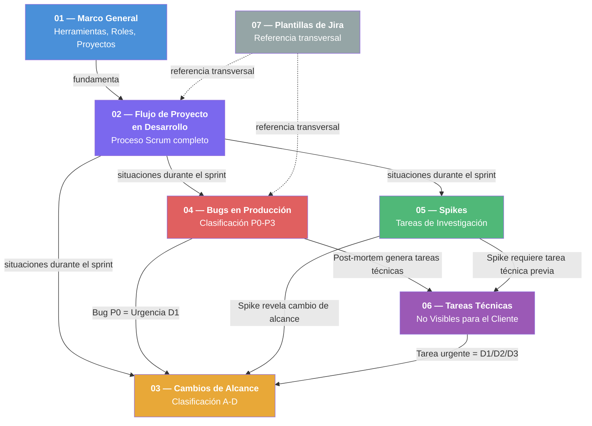

# Metodología de Trabajo — Tándem Digital

Documentación operativa para la gestión y desarrollo de proyectos de software en Tándem Digital.

---

## Acerca de esta documentación

Tándem Digital es una empresa de desarrollo de software especializada en proyectos del **sector salud y gobierno**. Gestiona múltiples proyectos en paralelo con equipos de PMs y desarrolladores.

Esta documentación define los procesos, flujos de trabajo y buenas prácticas estándar que rigen la operación de todos los proyectos.

### Objetivos del proceso

- Asegurar una comunicación clara y continua con el cliente.
- Mantener una comunicación fluida y coordinada dentro del equipo.
- Garantizar trazabilidad completa entre requerimientos, desarrollo y entregas.
- Asegurar calidad funcional y técnica en cada entregable.
- Estandarizar las prácticas de desarrollo y gestión en todos los proyectos.
- Integrar el uso de **Inteligencia Artificial** como acelerador del desarrollo.
- Medir el rendimiento del equipo y obtener métricas para la mejora continua.
- Documentar el conocimiento generado para facilitar el onboarding y la continuidad.

---

## Índice de documentos

### Fundamentos

| # | Documento | Descripción |
|---|-----------|-------------|
| 01 | [Marco General](01-marco-general.md) | Herramientas, roles y responsabilidades, tipos de proyecto y metodologías asociadas. |

### Flujo de trabajo principal

| # | Documento | Descripción |
|---|-----------|-------------|
| 02 | [Flujo de Proyecto en Desarrollo](02-flujo-proyecto-desarrollo.md) | Proceso completo Scrum: desde el inicio del proyecto con el cliente hasta la entrega, incluyendo recolección de requerimientos, planificación de sprints, desarrollo, revisión y deploy. |

### Situaciones específicas del flujo de trabajo

Estos documentos cubren escenarios que pueden ocurrir durante cualquier sprint o ciclo de trabajo:

| # | Documento | Descripción |
|---|-----------|-------------|
| 03 | [Gestión de Cambios de Alcance](03-gestion-cambios-alcance.md) | Cómo evaluar y manejar cambios que surgen durante un sprint. Clasificación A-D, reserva de capacidad y gestión de urgencias. |
| 04 | [Bugs en Producción](04-bugs-produccion.md) | Detección, clasificación (P0–P3), corrección, deploy y post-mortem de bugs en producción. |
| 05 | [Spikes — Tareas de Investigación](05-spikes-investigacion.md) | Gestión de tareas de investigación técnica y funcional cuando hay incertidumbre que impide estimar o desarrollar. |
| 06 | [Tareas Técnicas No Visibles](06-tareas-tecnicas.md) | Deuda técnica, refactors, seguridad, performance, tests y mejoras internas no visibles para el cliente. |

### Referencias

| # | Documento | Descripción |
|---|-----------|-------------|
| 07 | [Plantillas de Jira](07-plantillas-jira.md) | Configuración de plantillas Jira (Scrum, Kanban, Kanban simplificado), estados, tipos de tarea y etiquetas estándar. |

---

## Mapa de relaciones entre documentos

**Relaciones clave:**
- Un **bug P0** en producción (04) se trata como **urgencia crítica D1** según el proceso de cambios de alcance (03).
- Una **spike** (05) puede revelar cambios de alcance que se gestionan según (03).
- Las acciones preventivas de un **post-mortem** (04) frecuentemente generan **tareas técnicas** (06).
- Las **tareas técnicas urgentes** (06) se tratan como urgencias según la clasificación del documento de cambios de alcance (03).
- Una **spike** (05) puede concluir que se necesita una **tarea técnica** (06) como paso previo.

---

## Referencia rápida: Capacidad del sprint

| Concepto | Porcentaje | Detalle |
|----------|------------|---------|
| Trabajo planificado (features + tareas técnicas) | 75-80% | Funcionalidades visibles y tareas técnicas cuando corresponda |
| Reserva para urgencias | 20-25% | Absorbe imprevistos, bugs, cambios de alcance |

> Las tareas técnicas no visibles no requieren una reserva fija de capacidad. En proyectos en **Desarrollo** es buena práctica incluirlas cuando el equipo las identifique; en **Evolución** y **Mantenimiento** se priorizan desde el backlog según necesidad. Ver [Tareas Técnicas](06-tareas-tecnicas.md).

---

## Referencia rápida: Etiquetas de Jira

| Etiqueta | Uso | Documento |
|----------|-----|-----------|
| `production-bug` | Todos los bugs de producción | [04](04-bugs-produccion.md) |
| `hotfix` | Bugs que requieren deploy urgente | [04](04-bugs-produccion.md) |
| `cambio-alcance` | Cambios de alcance generales | [03](03-gestion-cambios-alcance.md) |
| `urgencia-critica` | Urgencias que afectan operación o pacientes | [03](03-gestion-cambios-alcance.md) |
| `urgencia-compromiso` | Urgencias por compromisos institucionales | [03](03-gestion-cambios-alcance.md) |
| `urgencia-operativa` | Urgencias importantes pero no críticas | [03](03-gestion-cambios-alcance.md) |
| `spike` | Tareas de investigación | [05](05-spikes-investigacion.md) |
| Tipo `Tech Task` | Todas las tareas técnicas no visibles (se identifican por el tipo de tarea en Jira) | [06](06-tareas-tecnicas.md) |

---

## Estado de la documentación

Esta documentación está **en evolución continua**. Se revisa y ajusta periódicamente con el objetivo de lograr un proceso claro, predecible, escalable y apoyado fuertemente en automatización e IA.
